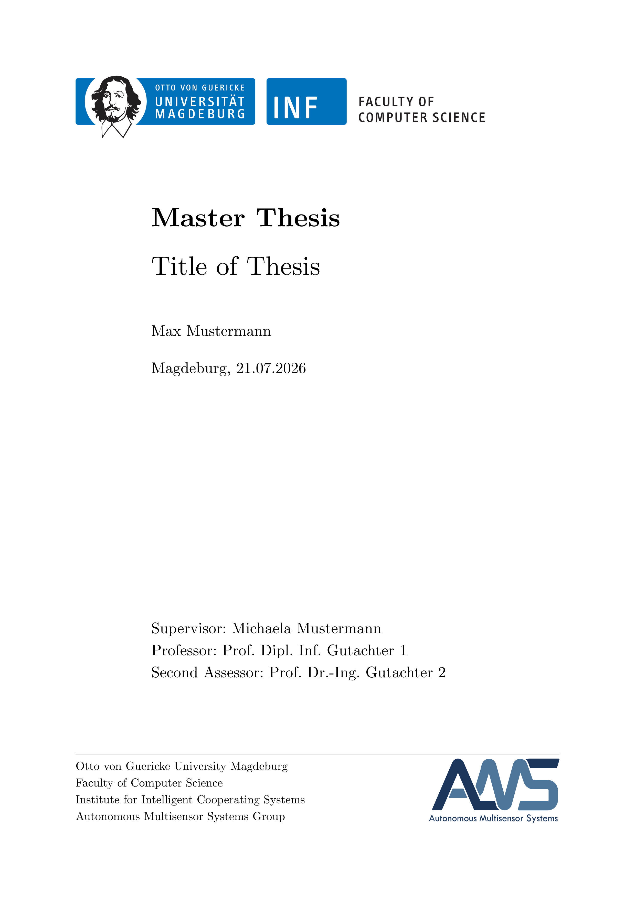
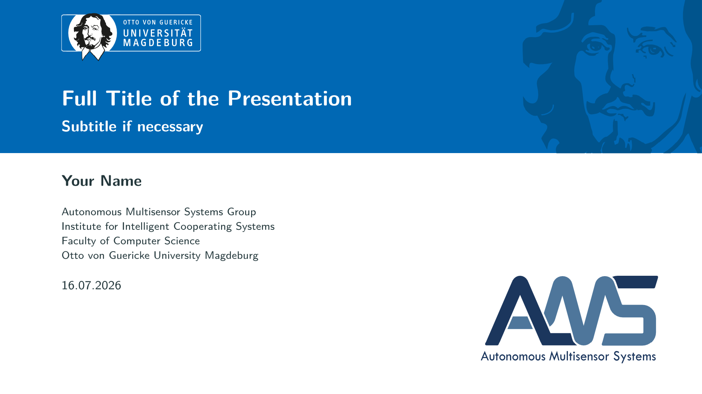

# Templates

This repository provides templates for the [Autonomous Multisensor Systems](https://ams.ovgu.de) group.

## Thesis

The [`Theses`](./Theses) folder provides LaTeX and Typst templates for bachelor, master and PhD theses.

## Presentations

The [`Presentations`](./Presentations) folder provides LaTeX, Typst and PowerPoint templates for presentations.

## Reports

The [`Reports`](./Reports) folder provides LaTeX templates for lab project reports as well as seminar reports.

<!-- TODO: insert image of title page -->

## Posters

The [`Posters`](./Posters) folder provides a PowerPoint template for a scientific poster in the faculty style.

<!-- TODO: insert image of title page -->
